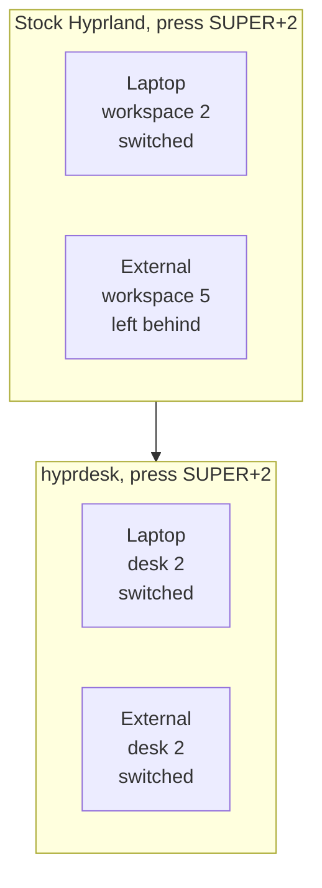
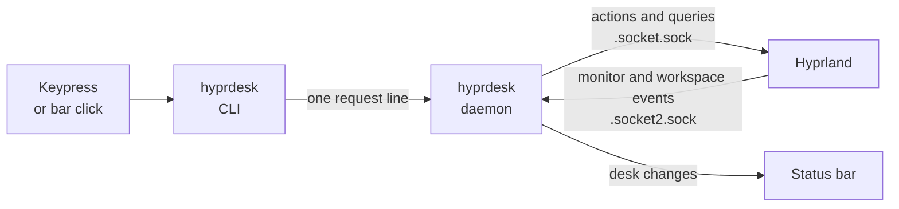

<div align="center">

# hyprdesk

**Virtual desktops for Hyprland that move all your monitors at once.**

One keypress switches every screen together, the way macOS Spaces and
Windows virtual desktops already do.

[](https://github.com/diego-lobo/hyprdesk/actions/workflows/ci.yml)
[](LICENSE)
[](https://hypr.land)
[](https://omarchy.org)
[](Cargo.toml)

<!-- ASSET: replace with assets/demo.gif once recorded. See assets/README.md -->


</div>

## The problem

Plug a second monitor into Hyprland and workspaces stop feeling like
desktops.

Workspaces belong to **one monitor at a time**. Press `SUPER+2` and only
the screen your mouse happens to be on changes. The other one keeps
showing whatever it was showing. To actually get to "my email setup" you
move the mouse to the laptop, press a key, move the mouse to the external,
press another key, and hope you remembered which number was which over
there.

Every other desktop OS solved this decades ago: a "desktop" is *all your
screens together*.



## What hyprdesk does

hyprdesk gives you **desks**. A desk is one desktop that spans every
monitor you have plugged in.

- **One keypress moves everything.** `SUPER+2` puts *all* your monitors on
  desk 2 at once.
- **Nothing gets left behind.** No more hunting for the window you were
  sure you left open.
- **Unplugging is safe.** Undock your laptop and the windows from the
  external monitor come with you. Plug it back in and they go home to
  exactly where they were, including after the monitor drops during sleep.
- **Your bar shows desks, not workspaces.** One clean strip of numbers
  instead of two sets that disagree with each other.

It runs as a small background program that talks to Hyprland over its
public IPC socket. It is **not a compositor plugin**, so a Hyprland update
cannot break the build and you never need `hyprpm`, root, or `sudo` for
any of it.

## Install

**Requirements:** Hyprland 0.55 or newer using the
[Lua config](https://hypr.land/news/26_lua/), and
[Rust](https://rustup.rs). Optional but recommended:
[Omarchy](https://omarchy.org) for the bar widget.

```bash
git clone https://github.com/diego-lobo/hyprdesk
cd hyprdesk
./scripts/install.sh
```

That builds the binary into `~/.local/bin`, links the keybinds into your
Hyprland config, turns on the bar widget if you are on Omarchy, and
reloads. It backs up anything it edits and prints exactly what it changed.

<details>
<summary><b>What the installer touches</b> (and how to do it by hand)</summary>

| What | Where | Why |
|------|-------|-----|
| Binary | `~/.local/bin/hyprdesk` | The daemon and the CLI, one file |
| Keybinds | `~/.config/hypr/hyprdesk.lua` (symlink into this repo) | Rebinds `SUPER+1..0` to desks |
| One line | appended to `~/.config/hypr/hyprland.lua` | `require("hypr.hyprdesk")` loads the above |
| Bar widget | `~/.config/omarchy/plugins/hyprdesk.desks` (symlink) | Draws the desk strip |

The config files are **symlinked** rather than copied, so `git pull`
updates them and an `omarchy update` cannot silently revert them.

To wire it manually, install the binary somewhere on your `PATH`, copy or
link `config/hypr/hyprdesk.lua` into `~/.config/hypr/`, and add
`require("hypr.hyprdesk")` to the end of your `hyprland.lua`.
</details>

<details>
<summary><b>Not on Omarchy?</b> Using waybar or another bar</summary>

The daemon streams a ready-made waybar module on stdout:

```jsonc
// ~/.config/waybar/config.jsonc - replace "hyprland/workspaces" with:
"custom/hyprdesk": {
  "exec": "hyprdesk waybar",
  "return-type": "json",
  "on-scroll-up": "hyprdesk prevdesk --cycle",
  "on-scroll-down": "hyprdesk nextdesk --cycle"
}
```

For anything else, `hyprdesk subscribe` prints the current desk number on
its own line every time it changes, which is enough to drive any bar that
can read a pipe.
</details>

## Keybindings

Everything below replaces the equivalent stock binding, so nothing new to
learn. The numbers are the same keys you already use.

| Keys | What it does |
|------|--------------|
| `SUPER` + `1`..`0` | Switch every monitor to that desk |
| `SUPER` + `SHIFT` + `1`..`0` | Move the focused window to that desk and follow it |
| `SUPER` + `SHIFT` + `ALT` + `1`..`0` | Send the focused window there, stay where you are |
| `SUPER` + `TAB` | Next desk |
| `SUPER` + `SHIFT` + `TAB` | Previous desk |
| `SUPER` + `CTRL` + `TAB` | Jump back to the desk you came from |
| `SUPER` + scroll | Cycle desks |

Left alone on purpose: the scratchpad, `ALT+TAB` window cycling,
`CTRL+ALT+TAB` monitor focus, and group switching. Edit
[`config/hypr/hyprdesk.lua`](config/hypr/hyprdesk.lua) to change any of
this; it is a short, commented file.

Every binding is also a command, so you can script them:

```bash
hyprdesk vdesk 3                # switch every monitor to desk 3
hyprdesk movetodesk 3           # move the focused window there and follow
hyprdesk movetodesksilent 3     # ...without following
hyprdesk nextdesk --cycle       # next desk, wrapping at 10
hyprdesk lastdesk               # back-and-forth
hyprdesk status --json          # {"desk":3,"last":1}
```

## The bar widget

<!-- ASSET: replace with assets/bar.png once captured. See assets/README.md -->


On Omarchy, hyprdesk ships a Quickshell widget that replaces the stock
workspaces indicator. It shows **desks** rather than raw workspace
numbers, which matters once you have two monitors: the stock widget only
knows about workspaces 1 to 10, so anything on your second monitor is
invisible to it and nothing lights up at all when your focus is over
there.

Click a number to jump to that desk. Scroll to cycle. Desks 1 to 5 are
always visible; higher ones appear once something is on them.

## How it works

Under the hood a desk is just a set of ordinary Hyprland workspaces, one
per monitor, kept welded together.

|  | Laptop *(slot 0)* | External *(slot 1)* | Third monitor *(slot 2)* |
|--|--|--|--|
| **Desk 1** | workspace 1 | workspace 11 | workspace 21 |
| **Desk 2** | workspace 2 | workspace 12 | workspace 22 |
| **Desk 10** | workspace 10 | workspace 20 | workspace 30 |

The last digit is the desk, the tens digit is the monitor. Workspace rules
pin each workspace to its monitor, so switching a desk is just "focus
workspace 2 and workspace 12", and the compositor puts them in the right
places. The arithmetic is stateless, which is why unplugging a monitor
does not need a remembered layout to recover from.



The daemon is the only thing holding state, and it holds almost none:
which desk you are on, and which one you were on before. Everything else
(monitors, workspaces, windows) is asked of the compositor at the moment
it is needed, so it can never be working from a stale picture of your
screen.

Deeper detail, including the exact Hyprland actions used and the reasoning
behind each design choice, lives in [`docs/DESIGN.md`](docs/DESIGN.md).

## Troubleshooting

Nothing happening? Start here:

```bash
hyprdesk status          # is the daemon alive and which desk does it think you are on?
hyprctl configerrors     # did the keybind file load cleanly?
```

The full checklist, including what to check after a Hyprland or Omarchy
update, is in [`docs/TROUBLESHOOTING.md`](docs/TROUBLESHOOTING.md).

## Uninstall

```bash
./scripts/uninstall.sh
```

Removes the binary, unlinks the config, restores the stock bar widget, and
reloads. Your windows and workspaces are left exactly where they are.

## Compatibility

| | Status |
|--|--|
| Hyprland 0.55+ (Lua config) | Supported, developed against 0.56.2 |
| Hyprland 0.54 and older (hyprlang config) | Not supported. Hyprland [deprecated hyprlang](https://hypr.land/news/26_lua/) and is removing it |
| Omarchy 4 "Quattro" | Fully supported, including the bar widget |
| Plain Hyprland + waybar | Supported via `hyprdesk waybar` |
| Single monitor | Works, and behaves like plain workspaces |
| Up to 8 monitors | Supported |

## Credits

The behavior hyprdesk emulates was defined by
[levnikmyskin/hyprland-virtual-desktops](https://github.com/levnikmyskin/hyprland-virtual-desktops),
an excellent Hyprland plugin. hyprdesk exists because the plugin route
depends on compositor internals that shift every release, and on `hyprpm`
state that wants root. This is an independent implementation over
Hyprland's stable public IPC instead. No code was copied; the dispatcher
semantics were read from the source and are documented in
[`docs/UPSTREAM-SEMANTICS.md`](docs/UPSTREAM-SEMANTICS.md).

If you want deep compositor integration and do not mind rebuilding on
Hyprland updates, use the plugin. If you want something that keeps working
across updates, use this.

## Contributing

Issues and pull requests are welcome. See
[CONTRIBUTING.md](CONTRIBUTING.md) for how to build, test, and what the
code standards are.

## License

[MIT](LICENSE) © Diego Lobato
