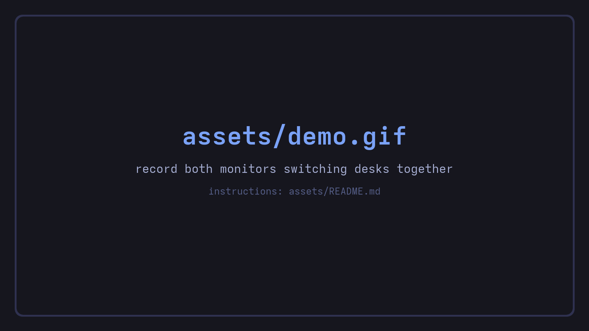
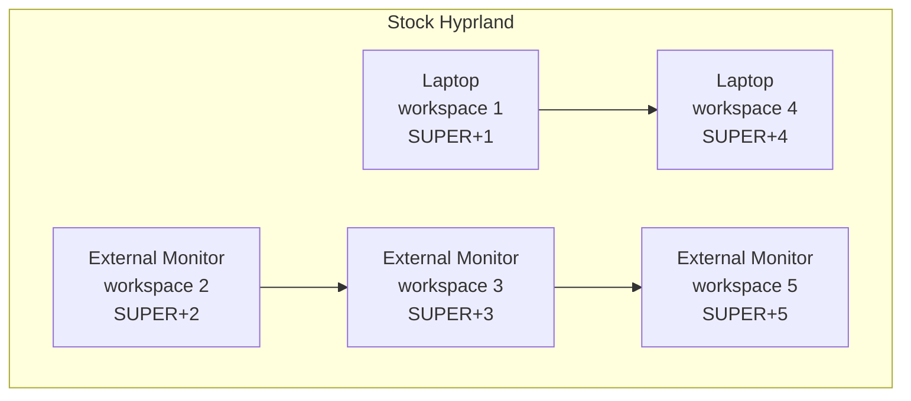
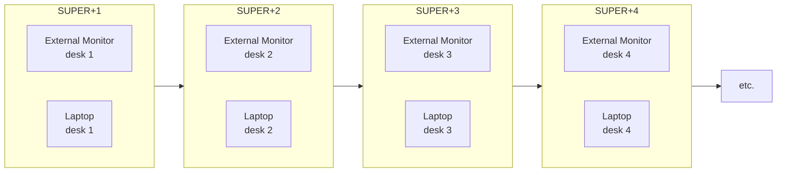

<div align="center">

# hyprdesk

**Virtual desktops for Hyprland that behave exactly like workspaces.**

One keypress switches every screen together, like macOS Spaces and
Windows virtual desktops.

[](https://github.com/diego-lobo/hyprdesk/actions/workflows/ci.yml)
[](LICENSE)
[](https://hypr.land)
[](https://omarchy.org)
[](Cargo.toml)



</div>

## The problem

Pluging a second monitor into a laptop running Hyprland causes your workspace locations to feel random and scattered. 

The user has no ability to assign their desired workspace hotkey (`SUPER+N`) to a specific monitor, leaving them stuck with scattered hotkeys:



## What hyprdesk does

hyprdesk joins all connected monitors into a single **desk**. 

This provides the best of both worlds: **The multi-workspace tiling of hyperland + the simple desktop behavior of windows/mac**



**Memory is stored on unplugging.** Undock your laptop and the windows from the
  external monitor behave like normal workspaces, orderly and as expected. Plug it back in and they return to exactly where they were before you undocked.


It runs as a small background program that talks to Hyprland over its
public IPC socket. It is **not a compositor plugin**, so a Hyprland update
cannot break the build and you never need `hyprpm`, root, or `sudo` for
any of it.

## Install

**Requirements:** Hyprland 0.55 or newer using the
[Lua config](https://hypr.land/news/26_lua/), and
[Rust](https://rustup.rs). 

**Optional but recommended:**
[Omarchy Quattro](https://omarchy.org) for the bar widget.

```bash
git clone https://github.com/diego-lobo/hyprdesk
cd hyprdesk
./scripts/install.sh
```

That builds the binary into `~/.local/bin`, links the keybinds into your
Hyprland config, turns on the bar widget if you are on Omarchy, and
reloads. It backs up anything it edits and prints exactly what it changed.

<details>
<summary><b>What the installer touches</b> (and how to do it by hand)</summary>

| What | Where | Why |
|------|-------|-----|
| Binary | `~/.local/bin/hyprdesk` | The daemon and the CLI, one file |
| Keybinds | `~/.config/hypr/hyprdesk.lua` (symlink into this repo) | Rebinds `SUPER+1..0` to desks |
| One line | appended to `~/.config/hypr/hyprland.lua` | `require("hypr.hyprdesk")` loads the above |
| Bar widget | `~/.config/omarchy/plugins/hyprdesk.desks` (symlink) | Draws the desk strip |

The config files are **symlinked** rather than copied, so `git pull`
updates them and an `omarchy update` cannot silently revert them.

To wire it manually, install the binary somewhere on your `PATH`, copy or
link `config/hypr/hyprdesk.lua` into `~/.config/hypr/`, and add
`require("hypr.hyprdesk")` to the end of your `hyprland.lua`.
</details>

<details>
<summary><b>Not on Omarchy?</b> Using waybar or another bar</summary>

The daemon streams a ready-made waybar module on stdout:

```jsonc
// ~/.config/waybar/config.jsonc - replace "hyprland/workspaces" with:
"custom/hyprdesk": {
  "exec": "hyprdesk waybar",
  "return-type": "json",
  "on-scroll-up": "hyprdesk prevdesk --cycle",
  "on-scroll-down": "hyprdesk nextdesk --cycle"
}
```

For anything else, `hyprdesk subscribe` prints the current desk number on
its own line every time it changes, which is enough to drive any bar that
can read a pipe.
</details>

## Keybindings

Everything mirrors the stock bindings, so there's nothing new to
learn.

| Keys | What it does |
|------|--------------|
| `SUPER` + `1`..`0` | Switch every monitor to that desk |
| `SUPER` + `SHIFT` + `1`..`0` | Move the focused window to that desk and follow it |
| `SUPER` + `SHIFT` + `ALT` + `1`..`0` | Send the focused window there, stay where you are |
| `SUPER` + `TAB` | Next desk |
| `SUPER` + `SHIFT` + `TAB` | Previous desk |
| `SUPER` + `CTRL` + `TAB` | Jump back to the desk you came from |
| `SUPER` + scroll | Cycle desks |


Every binding is also a command, so you can script them:

```bash
hyprdesk vdesk 3                # switch every monitor to desk 3
hyprdesk movetodesk 3           # move the focused window there and follow
hyprdesk movetodesksilent 3     # ...without following
hyprdesk nextdesk --cycle       # next desk, wrapping at 10
hyprdesk lastdesk               # back-and-forth
hyprdesk status --json          # {"desk":3,"last":1}
```


## Troubleshooting

Nothing happening? Start here:

```bash
hyprdesk status          # is the daemon alive and which desk does it think you are on?
hyprctl configerrors     # did the keybind file load cleanly?
```

The full checklist, including what to check after a Hyprland or Omarchy
update, is in [`docs/TROUBLESHOOTING.md`](docs/TROUBLESHOOTING.md).

## Uninstall

```bash
./scripts/uninstall.sh
```

Removes the binary, unlinks the config, restores the stock bar widget, and
reloads. Your windows and workspaces are left exactly where they are.

## Compatibility

| | Status |
|--|--|
| Hyprland 0.55+ (Lua config) | Supported, developed against 0.56.2 |
| Hyprland 0.54 and older (hyprlang config) | Not supported. Hyprland [deprecated hyprlang](https://hypr.land/news/26_lua/) and is removing it |
| Omarchy Quattro | Fully supported, including the bar widget |
| Plain Hyprland + waybar | Supported via `hyprdesk waybar` |
| Single monitor | Works, and behaves like plain workspaces |
| Up to 8 monitors | Supported |
| Any monitor arrangement | Supported, with nothing to configure. Side by side, stacked, portrait, mixed resolutions and scales all behave the same, because hyprdesk never reads monitor positions |

## Credits

The behavior hyprdesk emulates was defined by
[levnikmyskin/hyprland-virtual-desktops](https://github.com/levnikmyskin/hyprland-virtual-desktops),
an excellent Hyprland plugin. hyprdesk exists because the plugin route
depends on compositor internals that shift every release, and on `hyprpm`
state that wants root. 

This is an independent implementation over
Hyprland's stable public IPC instead. No code was copied, the dispatcher
semantics were read from the source and are documented in
[`docs/UPSTREAM-SEMANTICS.md`](docs/UPSTREAM-SEMANTICS.md).

## Contributing

Issues and pull requests are welcome. See
[CONTRIBUTING.md](CONTRIBUTING.md) for how to build, test, and what the
code standards are.

## License

[MIT](LICENSE) © Diego Lobato
